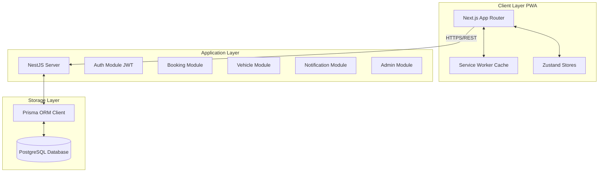

# ParkFlow AI System Architecture

This document describes the system architecture of ParkFlow AI, a smart car parking solution.

## Overall Architecture

ParkFlow AI is built as a modular monorepo consisting of a Next.js frontend application and a NestJS backend application.

## Resilience & Fallback Strategy

The application is architected to run in two modes:
1. **Database Mode (Connected)**: Standard production flow using PostgreSQL via Prisma.
2. **Fallback Mode (Graceful Degradation)**: If connection to PostgreSQL is unavailable, the NestJS backend and Next.js frontend automatically fall back to serving high-quality in-memory mock data. This allows gate operations, scanner interfaces, analytics charts, and bookings pages to continue running and rendering properly during demonstration or offline testing.

## Key Design Patterns

- **Theme Variable Layering**: Clean CSS-variable system that allows instantaneous light/dark mode transitions across both tailwind component layers.
- **Role-Based Guards**: Strict path and endpoint validation based on three roles: `CUSTOMER`, `OPERATOR` (Staff Portal access), and `ADMIN` (Control panel access).
- **QR Operations Flow**: Direct connection between booking creation, QR SVG rendering (using `qrcode.react`), check-in scans via simulator, and slot state transition within the database or in-memory manager.
