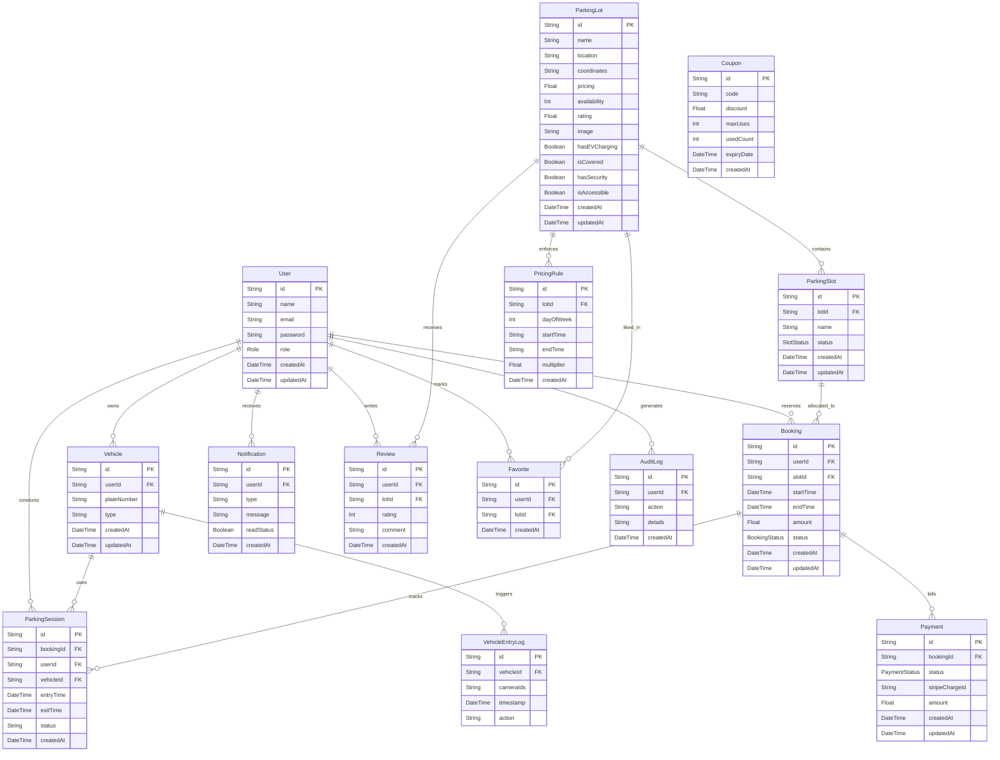

# ParkFlow AI Database Entity-Relationship Diagram

```mermaid
erDiagram
    User {
        String id PK
        String name
        String email
        String password
        Role role
        DateTime createdAt
        DateTime updatedAt
    }

    Vehicle {
        String id PK
        String userId FK
        String plateNumber
        String type
        DateTime createdAt
        DateTime updatedAt
    }

    ParkingLot {
        String id PK
        String name
        String location
        String coordinates
        Float pricing
        Int availability
        Float rating
        String image
        Boolean hasEVCharging
        Boolean isCovered
        Boolean hasSecurity
        Boolean isAccessible
        DateTime createdAt
        DateTime updatedAt
    }

    ParkingSlot {
        String id PK
        String lotId FK
        String name
        SlotStatus status
        DateTime createdAt
        DateTime updatedAt
    }

    Booking {
        String id PK
        String userId FK
        String slotId FK
        DateTime startTime
        DateTime endTime
        Float amount
        BookingStatus status
        DateTime createdAt
        DateTime updatedAt
    }

    Payment {
        String id PK
        String bookingId FK
        PaymentStatus status
        String stripeChargeId
        Float amount
        DateTime createdAt
        DateTime updatedAt
    }

    Notification {
        String id PK
        String userId FK
        String type
        String message
        Boolean readStatus
        DateTime createdAt
    }

    Review {
        String id PK
        String userId FK
        String lotId FK
        Int rating
        String comment
        DateTime createdAt
    }

    Favorite {
        String id PK
        String userId FK
        String lotId FK
        DateTime createdAt
    }

    AuditLog {
        String id PK
        String userId FK
        String action
        String details
        DateTime createdAt
    }

    Coupon {
        String id PK
        String code
        Float discount
        Int maxUses
        Int usedCount
        DateTime expiryDate
        DateTime createdAt
    }

    ParkingSession {
        String id PK
        String bookingId FK
        String userId FK
        String vehicleId FK
        DateTime entryTime
        DateTime exitTime
        String status
        DateTime createdAt
    }

    VehicleEntryLog {
        String id PK
        String vehicleId FK
        String cameraIds
        DateTime timestamp
        String action
    }

    PricingRule {
        String id PK
        String lotId FK
        Int dayOfWeek
        String startTime
        String endTime
        Float multiplier
        DateTime createdAt
    }

    User ||--o{ Vehicle : owns
    User ||--o{ Booking : reserves
    User ||--o{ Notification : receives
    User ||--o{ Review : writes
    User ||--o{ Favorite : marks
    User ||--o{ AuditLog : generates
    User ||--o{ ParkingSession : conducts

    Vehicle ||--o{ VehicleEntryLog : triggers
    Vehicle ||--o{ ParkingSession : uses

    ParkingLot ||--o{ ParkingSlot : contains
    ParkingLot ||--o{ Review : receives
    ParkingLot ||--o{ PricingRule : enforces
    ParkingLot ||--o{ Favorite : liked_in

    ParkingSlot ||--o{ Booking : allocated_to

    Booking ||--o{ Payment : bills
    Booking ||--o{ ParkingSession : tracks
```
